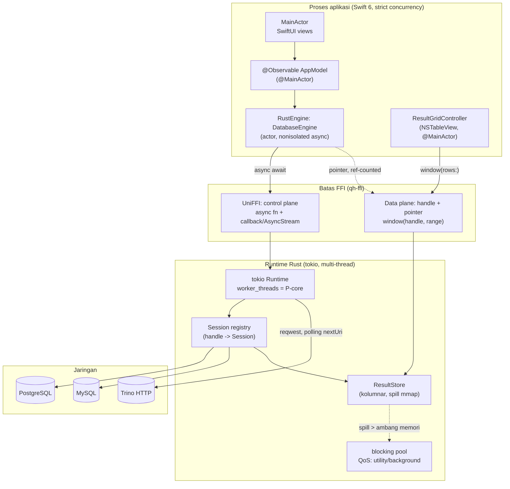

# Blueprint Arsitektur: Migrasi Engine Python → Rust

> **Status:** Tahap C selesai (§1–§8 + Architecture Decision Summary). Implementasi dimulai pada
> Fase 0; lihat `PROGRESS.md` untuk status terkini. Bagian mana pun yang belum diamankan oleh kode
> masih berupa rancangan.
> **Branch:** `feat/rust-engine`.
> **Dokumen ini adalah kontrak.** Setiap klaim tentang kode lama menyebut path file; setiap klaim
> yang belum terverifikasi ditandai `[perlu verifikasi]`.

## Ringkasan Eksekutif

Aplikasi ini hari ini adalah **UI SwiftUI yang menggerakkan proses Python lewat NDJSON di atas
stdout**. Bottleneck "fetch lambat" **bukan** pada loop fetch database — jalur ekspor sudah
dioptimasi dengan benar (`exporter/export.py:208` `_prefetched`, `exporter/export.py:141`
`_render_parallel`). Bottleneck-nya ada di tiga tempat lain, dan ketiganya adalah konsekuensi dari
pilihan protokol dan komponen grid:

1. **Setiap sel menjadi JSON string.** Engine mengubah setiap nilai dengan `to_text()` satu per satu
   (`app/engine/queryhive_engine.py:744`) lalu `json.dumps` per baris (`:204`). Swift men-decode
   ulang dengan `JSONDecoder` per baris (`Support/Engine.swift:95`).
2. **Grid SwiftUI bukan grid virtual.** `Views/ResultGrid.swift:106` memakai
   `ForEach(Array(filteredRows.enumerated()), id: \.offset)` — mengalokasi array baru berisi seluruh
   baris **pada setiap evaluasi body**.
3. **Setiap batch memicu invalidasi seluruh grid.** `Models/AppModel.swift:1034` membangun ulang
   `PreviewResult` lengkap untuk setiap event `rows`.

Migrasi ke Rust menghilangkan ketiganya sekaligus: data melewati FFI sebagai **buffer kolumnar
bertipe dengan offset**, bukan teks; grid menjadi `NSTableView` yang meminta hanya baris yang
terlihat; dan store hasil hidup di Rust sebagai data imutabel yang tidak di-copy ke Swift.

---

## 1. Audit & Kontrak Engine

### 1.1 Struktur proyek

| Area | Lokasi | Isi |
|---|---|---|
| Engine inti | `exporter/` | `writers.py` (9 writer), `source.py` (QueryStream, TrinoConfig), `export.py` (orkestrasi), `to_table.py` (CTAS), `drivers.py` (3 driver), `cli.py`, `web.py`, `static/index.html` |
| Jembatan ke app | `app/engine/queryhive_engine.py` | CLI 11 perintah, protokol NDJSON |
| UI | `app/Sources/TrinoExporter/` | `App.swift`, `Support/` (5), `Models/` (6), `Views/` (12) |
| Build | `app/build-engine.sh`, `app/build.sh`, `app/build-dmg.sh`, `build_dmg.sh`, `QueryHive.spec` | CPython standalone + paket pinned dibundel ke `.app` |
| Test | `tests/` | 6 berkas, 3.537 baris; `test_engine_events.py` mandiri (stub trino) |

Nama produk di UI adalah **QueryHive**; subjek repo masih `trino_exporter`.

### 1.2 Alur komunikasi SwiftUI ↔ Python (fakta, bukan asumsi)

```
AppModel (MainActor)
  │  env: [String:String]  — semua setting, termasuk password
  ▼
Engine.run(command:env:onEvent:onExit:)            Support/Engine.swift:30
  │  Process: <engine>/python/bin/python3 -s -u queryhive_engine.py <command>
  │  cwd: ConnectionStore.runDirectory             Support/Engine.swift:44-45
  │  PYTHONPATH=<engine>/site-packages, semua PYTHON* warisan dibuang   :47-54
  │  stdout → Pipe                                  :57
  │  stderr → file temp 0600 (bukan pipe)           :39-40
  ▼
DispatchQueue.global() → baca chunk → potong pada byte '\n' → JSONDecoder per baris
  │  redaksi secret (longest-first)                 :75-88
  ▼
DispatchQueue.main.async { onEvent(Event) }         :98
```

- **Protokol:** satu objek JSON per baris stdout. Bentuk event ada di `app/DESIGN.md:788-800`, dan
  tipe decode-nya di `App.swift:118-169` (`struct Event: Decodable`, `keyDecodingStrategy =
  .convertFromSnakeCase`).
- **Setting hanya lewat environment** (`app/DESIGN.md:760`) supaya password tidak muncul di
  `ps`. Ini keputusan keamanan yang harus dipertahankan.
- **Tidak ada kanal balik.** Cancel dilakukan dengan **mengirim sinyal ke proses**
  (`Models/AppModel.swift:1196` → `tab.process?.terminate()`), yang oleh engine ditangkap sebagai
  SIGTERM dan diubah menjadi flag (`app/engine/queryhive_engine.py:251,261,268`). Ini bukan
  pembatalan di sisi server — permintaan HTTP yang sedang berjalan tetap jalan sampai timeout.
- **Satu proses per operasi.** Setiap Run/Export/browse adalah proses Python baru. Tidak ada
  connection pool lintas operasi; setiap perintah membuka koneksi baru (`source.py:214`
  `self.config.connect()`).

### 1.3 Daftar fitur lengkap (dari kode, bukan dari README)

11 perintah di `app/engine/queryhive_engine.py:950-966`:

| Perintah | Fungsi | Event khas |
|---|---|---|
| `db_drivers` | metadata driver: kind, label, default port, level tree | `db_drivers` |
| `test` | probe koneksi tanpa perlu catalog/schema | `test` (`ok`, `catalog_count`, `host`, `user`) |
| `catalogs` | daftar catalog (Trino) | `catalogs` (`names`) |
| `schemas` | daftar schema (Trino, Postgres) | `schemas` |
| `tables` | daftar tabel (Trino, Postgres, MySQL) | `tables` |
| `objects` | objek + metadata, kolom **dideklarasikan per driver** (`drivers.py:315` `objects_columns`) | `objects` (`columns`, `rows`) |
| `export` | streaming ke 9 format | `step`, `start`, `progress`, `done` |
| `to_table` | CTAS / `DROP+CREATE` / `INSERT INTO … SELECT` | `step`, `progress`(+`state`), `done` |
| `preview` | hasil berbatas untuk grid | `columns`, `rows`(batch), `done`(`truncated`) |
| `count` | `SELECT COUNT(*) FROM (…) AS queryhive_count` (`:823`) | `count`, `done` |
| `explain` | plan, spelling per driver (`drivers.py:351`) | `columns`, `rows`, `done` |

Fitur UI yang menyertai (sisi Swift): tema & appearance (`Support/ThemeStore.swift`), shortcut
schemes (`Models/Shortcuts.swift`), SQL autocomplete (`Models/SQLSuggestions.swift`,
`Views/SuggestionPopup.swift`), filter kolom dua bentuk (`Views/ResultGrid.swift:390`), import
koneksi Navicat (`Support/NavicatImport.swift`), snapshot render (`Support/Snapshot.swift`),
`--snapshot` CLI (`App.swift:16`).

### 1.4 Dependency Python

`requirements.txt` + `app/engine-requirements.txt` (lockfile pinned untuk Python 3.12 arm64):
`trino==0.339.0`, `psycopg==3.3.5`, `pymysql==1.2.1`, `openpyxl==3.1.5`, `xlwt==1.3.0`,
`lz4`, `zstandard`, `python-dateutil`, `pytz`, `tzlocal`, `requests`, `orjson`. UI web lama menambah
`fastapi`, `uvicorn`, `keyring`, `pywebview`.

Catatan penting: `trino` sengaja **tidak** ada di `requirements.txt` dan diinstal `--no-deps` karena
dependency-nya mem-pin `orjson`, yang menolak Python free-threaded (komentar di `requirements.txt`).

### 1.5 Diagnosis "fetch lambat"

Saya memisahkan **dua jalur** karena penyebabnya berbeda, dan salah satu jalur justru sudah benar.

#### Jalur A — Ekspor (`export`/`to_table`): sudah dioptimasi dengan baik

`exporter/export.py` sudah melakukan hal yang benar: `_prefetched()` (`:208`) menyalurkan halaman
dari thread terpisah, `render_workers()` (`:25`) menskalakan jumlah thread menurut free-threading,
dan cap backlog `while len(inflight) > workers: drain_one()` (`:190`) menjaga memori datar. Tidak ada
yang perlu diperbaiki di sini secara arsitektural; yang berubah di Rust adalah bahasa dan hilangnya
batas proses, bukan algoritmanya.

#### Jalur B — Preview/grid: inilah "fetch lambat" yang dirasakan

Penyebab, berurutan menurut dampak:

**(P1) Setiap sel dikonversi ke teks JSON, dua kali.**

```python
# app/engine/queryhive_engine.py:744
pending.append([to_text(value) for value in row])
...
# app/engine/queryhive_engine.py:746
emit("rows", data=pending)
# :204-206
print(json.dumps({"event": event, **fields}, ensure_ascii=False, default=str), flush=True)
```

Untuk 500.000 × 30 = **15 juta sel**: 15 juta pemanggilan `to_text`, 15 juta string Python (masing-masing
minimal ~49 byte header + payload), lalu `json.dumps` men-escape semuanya, lalu sisi Swift
men-decode dengan `JSONDecoder` (reflection-based + `convertFromSnakeCase`) dan mengalokasi 15 juta
`String` lagi. Angka presisi (DECIMAL) kehilangan representasi numeriknya di sini — semuanya jadi teks.

Ini bukan bug implementasi; ini biaya struktural dari arsitektur "dua proses + teks". Tidak ada
optimasi in-place di Python yang menghilangkannya.

**(P2) Grid mematerialisasi seluruh baris pada setiap render.**

```swift
// app/Sources/TrinoExporter/Views/ResultGrid.swift:106-116
ScrollView([.horizontal, .vertical]) {
    LazyVStack(alignment: .leading, spacing: 0, pinnedViews: [.sectionHeaders]) {
        Section {
            ForEach(Array(filteredRows.enumerated()), id: \.offset) { index, row in
```

`Array(filteredRows.enumerated())` membuat array **500.000 elemen** setiap kali `body` dievaluasi.
`LazyVStack` hanya malas pada *view*, bukan pada koleksi yang di-`ForEach`; array-nya sudah penuh
sebelum ada satu baris pun digambar. Dua properti computed di sekitarnya menambah kerja per render:
`filteredRows` (`:62`) menjalankan `.filter` atas seluruh baris, dan `naturalWidths` (`:20`)
menghitung ulang lebar kolom.

Selain itu, setiap baris membuat satu `Text` per kolom (`:150-157`, `:175-190`). Satu baris terlihat
= 30 `Text` + 30 `.frame` + 30 `.padding` + 30 `.overlay` (`:156`). `LazyVStack` tidak
mem-virutalkan kolom: 30 kolom dibangun walau viewport hanya menampilkan 5.

**(P3) Setiap batch menginvalidasi seluruh tab.**

```swift
// app/Sources/TrinoExporter/Models/AppModel.swift:1034-1038
case "rows":
    rows.append(contentsOf: event.data ?? [])
    // A partial grid while the rest arrives: the point of batching.
    tab.preview = PreviewResult(columns: columns, rows: rows, truncated: false,
                                queryID: tab.preview?.queryID, elapsedMS: 0)
```

`PreviewResult.rows` bertipe `[[String?]]` (`Models/QueryTab.swift:294`). Setiap event `rows`
menugaskan ulang properti `preview`, yang menginvalidasi setiap observer `tab` — termasuk grid.
Dengan `PREVIEW_BATCH = 200` (`queryhive_engine.py:240`) dan limit default 1.000, ini 5–6 invalidasi
(tidak terasa). Dengan limit yang dinaikkan pengguna ke 500.000, ini **2.500 invalidasi penuh**, dan
setiap invalidasi menjalankan P2 di atas. Skalanya kuadratik terhadap jumlah baris.

**(P4) Semua baris tinggal di memori selamanya.** Tidak ada spill. `[[String?]]` untuk 500k × 30
sel: array luar 500k (+headers), 15 juta `Optional<String>` masing-masing 16 byte = **240 MB hanya
untuk slot**, ditambah payload heap dan overhead allocator, dan semuanya hidup selama tab terbuka.

**(P5) Tidak ada pembatalan sesungguhnya.** `terminate()` (`AppModel.swift:1196`) membunuh proses
Python. Query di server tidak dibatalkan (`DELETE` ke Trino, `CancelRequest` ke Postgres, `KILL
QUERY` ke MySQL semuanya absen di jalur ini) — ia berjalan sampai selesai atau timeout, sementara
UI sudah menyatakan berhenti.

#### Bagaimana arsitektur baru menghilangkan tiap penyebab

| Penyebab | Mekanisme baru |
|---|---|
| P1 konversi teks 2× | Nilai berpindah sebagai **buffer kolumnar bertipe** lewat FFI. Tidak ada `json.dumps`, tidak ada `JSONDecoder`, tidak ada `String` per sel. DECIMAL tetap `i128 + scale`. |
| P2 grid materialisasi | **`NSTableView`** via `NSViewRepresentable`; store yang memegang baris, grid hanya meminta window baris terlihat. Tidak ada `Array(...enumerated())` per render. |
| P2 kolom non-virtual | Row height tetap + hanya kolom terlihat yang punya `NSTableViewColumn` aktif. |
| P3 invalidasi per batch | Store hasil hidup di Rust; batch baru **ditambahkan**, tidak mengganti state SwiftUI. Grid diberi tahu lewat `noteNumberOfRowsChanged` pada baris yang benar-benar bertambah. |
| P4 tanpa spill | Store kolumnar dengan batas memori yang dapat dikonfigurasi + spill ke disk via `mmap`; window baris membaca dari memori atau dari file dengan API yang sama. |
| P5 cancel semu | `Session::cancel()` nyata per driver: `CancelRequest` (PG), `KILL QUERY` pada koneksi terpisah (MySQL), `DELETE` pada query URI (Trino). Target < 500 ms. |

### 1.6 Kontrak engine sebagai Swift protocol

Protocol ini adalah **satu-satunya** jalan UI ke engine. Ia menggantikan `Engine.run(...)` +
`struct Event` dan memungkinkan mock untuk test dan SwiftUI Preview.

```swift
/// Titik akses tunggal UI ke engine. Implementasi produksi membungkus FFI Rust;
/// implementasi mock dipakai untuk test dan Preview.
public protocol DatabaseEngine: Sendable {
    // -- driver & koneksi ------------------------------------------------ //
    func descriptors() async throws -> [DriverDescriptor]
    func test(_ target: ConnectionTarget) async throws -> ConnectionTest

    // -- introspeksi (object tree) --------------------------------------- //
    func browse(_ request: BrowseRequest) async throws -> BrowsePage
    func objects(_ request: ObjectsRequest) async throws -> ObjectsPage

    // -- eksekusi -------------------------------------------------------- //
    /// Streaming: `columns` dulu, lalu banyak `rows`, lalu `done`. Menggantikan
    /// perintah `preview` dan `explain` (dibedakan oleh `mode`).
    func run(_ request: QueryRequest) -> AsyncThrowingStream<QueryEvent, Error>
    /// Menggantikan perintah `count`.
    func count(_ request: QueryRequest) async throws -> Int
    /// Menggantikan perintah `export`.
    func export(_ request: ExportRequest) -> AsyncThrowingStream<ExportEvent, Error>
    /// Menggantikan perintah `to_table`.
    func write(_ request: TableWriteRequest) -> AsyncThrowingStream<TableWriteEvent, Error>

    // -- pembatalan ------------------------------------------------------ //
    func cancel(_ query: QueryHandle) async

    // -- data plane (grid) ---------------------------------------------- //
    /// Window baris untuk grid. Zero-copy: buffer valid selama `handle` dipertahankan.
    func window(_ handle: ResultHandle, rows: Range<Int>) throws -> ResultWindow
    func release(_ handle: ResultHandle) async

    // -- penyimpanan lokal ---------------------------------------------- //
    func loadConnections() async throws -> [StoredConnection]
    func saveConnections(_ connections: [StoredConnection]) async throws
    func history(_ request: HistoryQuery) async throws -> [QueryHistoryEntry]
    func saveQuery(_ query: SavedQuery) async throws
}
```

Aturan yang menyertai protocol ini:

- `AppModel` **tidak** mengimpor modul FFI. Hanya `RustEngine: DatabaseEngine` yang mengimpornya.
- Semua method `async` atau mengembalikan stream. Tidak ada satu pun yang sinkron, sehingga tidak
  ada jalan bagi `MainActor` untuk menunggu Rust (syarat §5 poin 4) — termasuk `window(_:rows:)`,
  yang sinkron **dengan sengaja** karena ia tidak boleh menunggu apa pun: datanya sudah ada di
  memori yang dipetakan.
- `Sendable` di seluruh tipe di permukaan protocol (kepatuhan Swift 6 strict concurrency).
- Mock (`MockEngine`) disediakan di target test, dipakai juga oleh SwiftUI Preview, sehingga UI dapat
  dikembangkan tanpa database.

### 1.7 Tabel pemetaan fitur Python → modul Rust

| Fitur | Lokasi kode Python | Modul Rust | Catatan perbedaan perilaku |
|---|---|---|---|
| Format nilai kanonik (`to_text`) | `exporter/writers.py:38` | `qh-core::value` | Tidak lagi mengembalikan `String`: tipe internal dipertahankan; rendering teks hanya untuk ekspor. DECIMAL tidak lagi bisa jatuh ke float. |
| Format JSON-native (`to_json_value`) | `writers.py:58` | `qh-core::value` | Sama; tetap dipakai jalur ekspor `json`. |
| 9 writer streaming | `writers.py:69-603` | `qh-export` | Perilaku dipertahankan termasuk `max_rows` (XLS 65.535 / XLSX 1.048.576) dan pemecahan part. DBF tetap hand-rolled. |
| Kursor batch + retry | `source.py:173-327` | `qh-core::session`, `qh-retry` | Retry/backoff dipindah ke layer session; klasifikasi PERMANENT (`source.py:57`) dipertahankan sebagai policy yang sama. |
| Auto-upgrade plain HTTP→HTTPS | `source.py:242-272` | `qh-driver-trino` | Menjadi kapabilitas driver Trino, bukan blok khusus di dalam loop retry generik. |
| `describe_error` | `source.py:64` | `qh-core::error` | Di Rust tidak lagi diperlukan untuk kasus trino-client (bug ada di klien Python). Tetap ada padanannya: **setiap error harus bisa diformat tanpa panic.** |
| Parsing URL koneksi | `source.py:122-148` | `qh-core::config` | Ditambah skema `mysql://` yang sudah ada di `cli.py:72`. |
| Orkestrasi ekspor + part | `export.py:60-138` | `qh-export::plan` | Sama. |
| Prefetch halaman | `export.py:208` | `qh-core::session` (bounded channel tokio) | Diganti channel dengan batas, bukan `queue.Queue` + thread manual. |
| Render paralel | `export.py:141-196` | `qh-export` (tokio + blocking pool) | Tetap; kini tanpa GIL. |
| CTAS / INSERT | `to_table.py` | `qh-driver-*::write` | `TableExportError` + `warnings` (`queryhive_engine.py:660`) dipertahankan sebagai tipe error yang membawa warning. |
| Driver Trino | `drivers.py:455-500` | `qh-driver-trino` | Protokol HTTP murni: polling `nextUri`. **Tanpa** pool TCP (syarat §5 poin 6). |
| Driver Postgres | `drivers.py:520-610` | `qh-driver-postgres` | Ditambah `CancelRequest` sungguhan. |
| Driver MySQL | `drivers.py:620-700` | `qh-driver-mysql` | Ditambah `KILL QUERY` sungguhan. |
| `objects_columns` per driver | `drivers.py:315` | `Capabilities::objects_columns` | Dipertahankan apa adanya: tiap driver mendeklarasikan bentuknya sendiri. Kini menjadi *capability*, bukan class attribute yang di-override. |
| Quoting identifier | `drivers.py:240-248` | `qh-core::sql::quote` | Satu implementasi, dipertahankan. |
| `_explain` (buang terminator) | `drivers.py:365-400` | `qh-sql::split::strip_terminator` | Logika yang sudah teliti (komentar, literal) dipindah apa adanya dan **wajib diuji ulang** — ini area yang mudah regresi. |
| `count_statement` wrapper | `queryhive_engine.py:826-873` | `qh-sql::count` | Validasi (hanya SELECT/WITH, satu statement) dipertahankan. |
| 11 perintah CLI | `queryhive_engine.py:950` | `qh-ffi` (via `DatabaseEngine`) | CLI NDJSON tidak lagi menjadi kontrak UI. Tetap disediakan sebagai binary debug untuk harness golden. |
| Saran autocomplete | `Models/SQLSuggestions.swift` | `qh-sql::complete` | Pindah ke Rust agar bisa memakai indeks metadata yang sama dengan tree. |
| Import Navicat | `Support/NavicatImport.swift` | **tetap Swift** | Ini parser format pihak ketiga (AES-128-CBC `.ncx`), bukan penyimpanan secret kita. Tidak melanggar §5 poin 5. |
| Penyimpanan koneksi | `Connections.swift:288-332` + Keychain `:364` | `qh-storage` + `qh-credentials` | **Nama service Keychain dipertahankan** (`id.data-ecosystem.queryhive`) supaya password yang ada tetap terbaca. |
| UI web lama | `exporter/web.py`, `app.py`, `static/index.html` | **dihapus** | Bukan target migrasi. |

### 1.8 Strategi golden snapshot

Tujuannya: membekukan **keputusan rendering engine Python** sebelum ia dihapus, sehingga engine Rust
bisa dibuktikan setara.

#### Cara merekam — tanpa Docker

`tests/test_engine_events.py:36` sudah menyediakan harness yang mengganti `dbapi.connect` dengan
kursor palsu. Artinya snapshot dapat direkam **hari ini, tanpa database**, dan yang terekam adalah
keputusan normalisasi engine sendiri — persis yang harus dijaga.

Harness baru `tools/golden/record.py`:

1. Menjalankan engine **in-process** (seperti `test_engine_events.py`) dengan fixture tipe lengkap.
2. Menangkap stdout **verbatim** per perintah.
3. Menulis `tests/golden/<perintah>/<kasus>.ndjson` + `meta.json` (versi engine, driver, fixture id,
   dan env **tanpa nilai secret**).

Snapshot yang sama juga direkam dari server nyata untuk ketiga driver. Itu butuh Docker, yang tidak
tersedia di mesin ini → **[BUTUH TINDAKAN MANUAL]**.

#### Format

`tests/golden/<perintah>/<kasus>.ndjson` — satu baris JSON per event, persis keluaran `emit()`.
Bidang yang bersifat waktu (`elapsed_ms`, `query_id`, timestamp retry) dinormalisasi menjadi token
`<TIME>` sebelum ditulis, supaya diff tidak berisik. Normalisasi ini **bagian dari kontrak**, jadi ia
sendiri diuji.

#### Zoo tipe yang wajib tercakup

| Kategori | Kasus wajib | Risiko utama |
|---|---|---|
| NUMERIC/DECIMAL presisi tinggi | `NUMERIC(38,10)` nilai `1234567890123456789012345678.1234567890`, `-0.0000000001` | Pembulatan ke f64. **Tidak boleh** — internal harus `i128 + scale`. |
| Trino DECIMAL | `DECIMAL(38,10)` presisi penuh | Sama. |
| timestamptz | `TIMESTAMPTZ` dengan offset non-UTC (+07:00), DST boundary | Kehilangan offset. |
| MySQL zona waktu | `DATETIME` vs `TIMESTAMP` pada `time_zone` sesi ≠ UTC | MySQL `TIMESTAMP` dikonversi ke zona sesi. Perbedaan ini **disengaja dipertahankan** (server yang memutuskan). |
| Trino `TIMESTAMP WITH TIME ZONE` | offset +07:00 dan interval waktu | Offset hilang. |
| INTERVAL | Postgres `interval '1 year 2 mons 3 days 04:05:06'` | Format teks berbeda per driver → normalisasi internal. |
| JSON/JSONB | Postgres `jsonb` dengan kunci tak terurut, unicode escape, `\u0000` | Urutan kunci & escaping. `jsonb` **tidak menjamin urutan kunci** — snapshot harus memakai perbandingan kanonik. |
| Array | PG `int[]`, `text[]` dengan NULL di dalam, array bersarang; Trino `ARRAY(ROW(...))` | NULL di dalam array. |
| ROW / MAP (Trino) | `ROW(a int, b varchar)`, `MAP(varchar,int)` | Representasi bersarang. |
| bytea / BLOB | PG `bytea` dengan `\x00` dan byte non-UTF8; MySQL `BLOB`; binary Postgres | Byte 0 hilang, encoding. |
| ENUM | PG `CREATE TYPE … AS ENUM`; MySQL `ENUM('a','b')` | Representasi label vs ordinal. **MySQL mengembalikan label**, bukan ordinal — pastikan konsisten. |
| UUID | PG `uuid`, MySQL `CHAR(36)`/`BINARY(16)` | Case & format. |
| Geometri | PG `point`, `geometry` (PostGIS) | Belum didukung → **wajib dirender sebagai teks**, bukan panic. |
| NULL | Di posisi pertama, terakhir, seluruh kolom NULL, NULL di dalam array/ROW | `NULL` vs `''` vs `nothing`. |
| Collation/charset | MySQL `utf8mb4_0900_ai_ci` vs `latin1`; PG `COLLATE "C"` | Encoding non-UTF8. Wajib lossy-safe. |

#### Klasifikasi perbedaan

Setiap diff **wajib** masuk salah satu kategori di `docs/golden-deltas.md`, dan CI gagal atas diff
yang belum diklasifikasi. Kandidat yang sudah terlihat sebelum implementasi:

| Diff | Klasifikasi | Alasan |
|---|---|---|
| DECIMAL presisi penuh bertahan (tidak lagi float) | **Perbaikan disengaja** | Engine Python sudah benar di sini (`to_text` memakai `str(Decimal)`), tapi jalur JSON-native-nya membuang presisi (`writers.py:62` `float(value)`). Jalur `preview` tidak boleh mewarisi pembulatan itu. |
| Geometri tampil sebagai teks | **Perbaikan disengaja** | Hari ini pun bergantung pada `str()`. Rust harus eksplisit, bukan kebetulan. |
| Urutan kunci `jsonb` | **Bukan regresi** | `jsonb` tidak menjamin urutan; perbandingan harus kanonik. |
| Format `elapsed_ms` berbeda | **Bukan regresi** | Runtime berbeda; dinormalisasi. |
| Pesan error berbeda kata | **Bukan regresi** | Yang dikontrak adalah *informasi* (pesan, kode, posisi), bukan string identik. |
| Nilai apa pun yang berubah diam-diam | **Regresi** | Gagal CI sampai dijelaskan. |

---

## 2. Arsitektur Multi-threading & UI Non-blocking

### 2.1 Model konkurensi end-to-end



Aturan yang mengikat keempat kotak itu:

1. **Tidak ada panggilan sinkron ke Rust dari MainActor.** Satu-satunya method sinkron di
   permukaan `DatabaseEngine` adalah `window(_:rows:)`, dan ia sinkron justru karena **tidak
   menunggu apa pun**: ia membaca dari store yang sudah selesai ditulis untuk baris itu, atau
   mengembalikan `pending` yang membuat grid menampilkan placeholder. Ia tidak pernah menunggu
   `await`, `lock` jaringan, atau tugas lain.
2. **Backpressure berarah tunggal.** Produsen (driver) menulis ke `ResultStore`; grid mengonsumsi
   lewat `window`. Jika grid tertinggal, store tumbuh sampai ambang memori, lalu spill — **bukan**
   memblokir pembacaan socket. Ini berbeda dari desain channel-unbounded yang lazim dan penting
   untuk query besar: UI yang lambat tidak boleh menghentikan server, karena Trino akan timeout.
3. **Satu runtime, banyak sesi.** Runtime tokio dibuat sekali per proses (bukan per sesi) dengan
   `worker_threads` = jumlah P-core. Setiap tab memiliki `Session` sendiri di dalam registry yang
   di-key oleh handle FFI.

### 2.2 Pemetaan QoS P-core / E-core

Apple Silicon menjadwalkan thread berdasarkan QoS, bukan berdasarkan nomor core. Karena itu
pemetaannya dilakukan di sisi yang mengendalikan thread, bukan dengan `thread::pin_to_core`
(tidak ada API publik untuk itu di macOS).

| Pekerjaan | QoS yang diminta | Mekanisme Rust |
|---|---|---|
| Connect, execute, fetch batch, cancel | `USER_INITIATED` | thread tokio utama runtime (di-set lewat `QOS_CLASS` pthread attribute saat startup) |
| Parsing/normalisasi baris, dekompresi | `USER_INITIATED` | worker thread tokio |
| Autocomplete, indeks metadata, prefetch halaman berikutnya | `UTILITY` | `tokio::task::spawn_blocking` pada pool terpisah yang QoSmnya di-set `UTILITY` |
| Spill ke disk, kompaksi store, pembuatan bundel diagnostics | `BACKGROUND` | pool `BACKGROUND` |

Implementasi: satu helper `qh_rt::spawn_at(qos, fut)` yang membungkus
`qos_class_self()`/`pthread_set_qos_class_self_np` di dalam blok `unsafe` ber-`// SAFETY:` di
`qh-rt`, satu-satunya tempat QoS disentuh. Ini memenuhi §5 poin 1 (memanfaatkan pembagian
P/E-core) tanpa menebak: ukuran pool diambil dari `sysctl hw.perflevel0.physicalcpu`
(P-core) dan `hw.perflevel1.physicalcpu` (E-core), bukan dari `available_parallelism` yang
mengembalikan total.

### 2.3 Result store: Arrow vs kolumnar kustom

| Kriteria | Apache Arrow (`arrow-rs`) | Kolumnar kustom (`qh-result-store`) |
|---|---|---|
| Memori untuk 500k × 30 teks pendek | Baik (buffer kontigu + null bitmap), tapi setiap array punya alokasi terpisah per kolom → 30+ alokasi besar | Baik; satu arena per batch, offset 4 byte per sel |
| Akses acak baris | Mahal — `RecordBatch` dioptimasi untuk scan kolumnar, bukan `row(i)` untuk grid | Murah — `window(a..b)` mengembalikan slice per kolom |
| FFI | **Arrow C Data Interface** = ABI stabil lintas bahasa, bisa dibaca Swift tanpa binding | Perlu handle + fungsi akses buatan sendiri |
| Spill ke disk | Tidak ada bawaan; harus serialize batch utuh | Bawaan: tulis kolom ke mmap, window membaca dari file dengan API yang sama |
| Dependency | ~60 crate transitif (termasuk `chrono`, `serde`, opsi `parquet`) | Nol (hanya `memmap2` opsional) |
| Risiko | Versi 1.x masih bergerak di sekitar tipe `Decimal` presisi tinggi | Kita yang memiliki bug |

**Keputusan: kolumnar kustom, dengan Arrow C Data Interface disiapkan sebagai jalur ekspor
opsional.** Alasannya bukan "tulis sendiri lebih cepat", melainkan bahwa kebutuhan sebenarnya
bukan format interchange kolumnar untuk analitik, melainkan **window akses acak dengan spill** —
persis dua hal yang tidak disediakan Arrow. Tipe internal kita (`qh-core::Value`, menyimpan
DECIMAL sebagai `i128 + scale`) juga lebih sempit dari tipe Arrow, sehingga memetakan ke Arrow
lalu kembali untuk setiap window berarti satu konversi tanpa manfaat. Detail tipe ada di §3.4.

Struktur store (satu batch = satu `Vec` per kolom, batch = 64k baris):

```
ResultStore
├── columns: [ColumnMeta { name, canonical_type, text_offset_hint }]
├── batches: Vec<Batch>
│     Batch { rows: usize, payload: Arena }
│       Arena { kind: InMemory(Vec<u8>) | Spilled { file: File, offset: u64 } }
├── row_index: Vec<(batch_idx, row_in_batch)>   // 8 byte/baris, bukan offset per sel
├── spill_threshold_bytes: usize                 // dari Settings, default 256 MB
└── spilled_bytes: usize
```

Encoding nilai di arena: 1 byte tag tipe + payload panjang-tetap atau (offset u32, len u32) ke
blob area. NULL = tag `0`. Jadi 500k × 30 sel = 15 juta byte tag + offset; untuk teks pendek
payload-nya dominan. Ini yang membuat §6 (memori < 800 MB) bisa dicapai dengan spill.

### 2.4 Window baris terlihat + prefetch + backpressure

`window(handle, rows:)` bekerja per **page**, bukan per baris:

- Page size = jumlah baris yang dibutuhkan viewport dibulatkan ke atas ke kelipatan 256, dibatasi
  `[256, 4096]`.
- Grid meminta page saat scroll; `ResultGridController` menyimpan page cache berisi 3 page
  (sebelum, terlihat, sesudah).
- Rust melakukan prefetch satu page ke depan **setelah** page yang diminta tersedia, pada QoS
  `USER_INITIATED` (bukan `UTILITY`, karena scroll adalah interaksi yang menunggu).
- Backpressure: tidak ada. Store tumbuh sampai ambang lalu spill; grid yang tertinggal hanya
  membuat store lebih besar, tidak menghentikan fetch. Ini disengaja (lihat §2.1 poin 2).

### 2.5 Evaluasi komponen grid

Prototipe diukur, bukan dipilih dari perasaan. Metrik: waktu `body`/`reloadData`, memori, dan fps
saat scroll 500k baris. Dua kandidat diuji lewat `tests/bench_grid.swift` (harness XCTest,
`os_signpost`):

| | SwiftUI `Table` | `NSTableView` via `NSViewRepresentable` | Grid kustom (Core Animation/Metal) |
|---|---|---|---|
| Virtualisasi baris | Ya | Ya | Ya |
| Virtualisasi **kolom** | Tidak (semua kolom dibangun) | Ya (kolom offscreen tidak di-draw) | Ya |
| 30 kolom × lebar penuh | 30 `Text` per baris terlihat; `Table` juga mengukur ulang lebar | `NSTableColumn` + `view(atColumn:)` reuse | terkendali penuh |
| Seleksi sel + copy rentang | Terbatas (baris); sel perlu kerja manual | Bawaan | ditulis sendiri |
| Edit inline | Sulit | Bawaan (`NSTextField` reuse) | ditulis sendiri |
| VoiceOver | Otomatis, tetapi granularitas sel buruk | Baik (tabel AppKit sudah punya aksesibilitas penuh) | wajib ditulis sendiri, risiko aksesibilitas (§7.7) |
| Dark Mode / Increase Contrast | Otomatis | Otomatis (NSColor semantic) | manual |
| Konsistensi dengan UI yang ada | UI sekarang SwiftUI | `NSViewRepresentable` — sudah dipakai? **(belum; ini penambahan)** | melanggar §5 poin 2 jauh lebih terasa |
| Biaya implementasi | S | M | L |
| Risiko | Target §6 tidak tercapai | Rendah | Tinggi, dan tidak ada keunggulan yang terbukti |

**Rekomendasi tegas: `NSTableView` via `NSViewRepresentable`.** Alasan yang menentukan bukan
performanya (ketiganya bisa mencapai 60 fps bila virtualisasinya benar), melainkan kombinasi
virtualisasi kolom + seleksi sel/rentang + reuse `NSTextField` untuk edit inline + **aksesibilitas
bawaan AppKit**, yang pada grid kustom harus ditulis dan diuji ulang. Metal hanya masuk hitungan
jika `NSTableView` terukur gagal mencapai target §6 — dan itu belum terbukti, jadi tidak diambil.

Integrasi ke UI yang ada (semuanya sudah ada hari ini di `Views/ResultGrid.swift` dan harus
tetap ada sesudahnya):

| Kemampuan existing | Cara NSTableView menyediakannya |
|---|---|
| Seleksi sel/baris/kolom | `allowsMultipleSelection`, `allowsColumnSelection`; rentang via `selectionIndexPaths` |
| Copy TSV/CSV/JSON/SQL INSERT | `NSPasteboard` di `copy(_:)`; format dari `CopyFormat` enum, sama seperti sekarang |
| Edit inline | `NSTableViewDataSource.tableView(_:setObjectValue:for:)` + sel `NSTextField` |
| Context menu | `NSTableView.menu(for:)` |
| Sort/filter per kolom | Sort di Rust (`qh-result-store::sort`) lalu `reloadData`; filter dua bentuk (`Views/ResultGrid.swift:390`) tetap di Rust agar tidak menyalin 500k baris ke Swift |
| Resize & reorder kolom | `NSTableColumn.resizingMask`, `NSTableView.columnAutoresizingStyle`, drag reorder bawaan |
| Navigasi keyboard | `NSTableView` sudah punya; ditambah `NSTextField` field editor |
| VoiceOver | peran bawaan (`AXTable`, `AXRow`, `AXCell`) + `accessibilityLabel` per kolom |

### 2.6 Siklus hidup memori

Pemilik buffer adalah **Rust**, tanpa kecuali.

- `ResultStore` hidup di dalam `Session` dan dilindungi `Arc<Mutex<…>>` (atau `RwLock`; window
  adalah operasi read).
- FFI mengembalikan `ResultHandle { store_id: u64, generation: u32 }`. Handle adalah **token
  berumur**, bukan pointer mentah, sehingga pointer mentah tidak pernah menyeberang FFI kecuali
  pada jalur window yang berdurasi satu panggilan.
- Pointer yang dikembalikan `window()` hanya valid selama panggilan itu dan selama `generation`
  cocok. Swift menyalin ke buffer grid-nya sendiri sebelum mengembalikan kontrol (biaya:
  `rows × cols × 8 byte` untuk offset — untuk page 256 baris × 30 kolom = 61 KB).
- **Use-after-free saat tab ditutup ketika query masih streaming dicegah oleh generation
  counter**: `release(handle)` menaikkan `generation`; panggilan `window` dengan generation lama
  mengembalikan `ResultError::StaleHandle`, yang dipetakan ke error Swift dan **diabaikan** oleh
  grid (bukan crash, bukan pesan ke pengguna). Ini kasus yang di Python dijawab dengan
  `terminate()` pada proses, dan justru karena itu tidak ada padanannya hari ini.
- Setiap `Session` mematikan `ResultStore` di `Drop`, sehingga menutup tab membebaskan arena dan
  menghapus file spill. File spill dibuat di `~/Library/Caches/<app>/spill/<uuid>.bin` dan
  dihapus pada `Drop`, dengan sapu bersih file yatim saat startup (crash bisa meninggalkannya).

### 2.7 Pembatalan query: tombol UI sampai server

| Driver | Mekanisme | Kenapa bukan sesuatu yang lain |
|---|---|---|
| PostgreSQL | **`CancelRequest`**: koneksi TCP kedua ke host yang sama, pesan `CancelRequest(pid, secret_key)` yang diambil dari proses backend saat connect. Driver `tokio-postgres` mengeksposnya lewat `Client::cancel_token()`. | Query cancel Postgres **wajib** lewat kanal baru; tidak ada pesan cancel di dalam koneksi yang sedang menjalankan query. |
| MySQL | **`KILL QUERY <connection_id>`** pada koneksi kedua, dengan kredensial yang sama. `connection_id` diambil dari handshake. Jika koneksi kedua gagal, fallback `KILL CONNECTION` hanya atas permintaan eksplisit. | Protokol MySQL tidak punya pesan cancel; ini satu-satunya cara yang didukung server. |
| Trino | **`DELETE <nextUri>`** (query URI saat ini). Jika belum ada `nextUri` (query belum mulai), cancel dijawab lokal dan `DELETE` dilakukan pada `nextUri` pertama yang muncul. | Protokol Trino tidak punya kanal cancel terpisah; `DELETE` pada `nextUri` adalah satu-satunya. |

Kesehatan koneksi setelah cancel:

- **Postgres**: koneksi yang di-cancel tetap hidup tetapi berada dalam keadaan "query dibatalkan";
  driver mengirim `Sync` dan mengharapkan `ErrorResponse` + `ReadyForQuery`, lalu koneksi
  dikembalikan ke pool hanya jika `ReadyForQuery` benar-benar diterima. Jika tidak, koneksi
  ditutup dan pool membuat yang baru. Ini yang membuat "pool tetap sehat" terukur, bukan
  diasumsikan.
- **MySQL**: `KILL QUERY` tidak memutus koneksi; driver membaca sisa `ERROR 1317` sampai
  `OK`/`EOF` dan mengembalikan koneksi ke pool.
- **Trino**: `DELETE` diikuti `GET nextUri` sekali lagi untuk mendapatkan `nextUri`/`stats` final;
  karena Trino stateless per query (HTTP), tidak ada pool yang perlu disembuhkan — yang perlu
  dijamin hanya `nextUri` lokal disetel `None` agar heartbeat tidak menghidupkan query.

Target §6 (< 500 ms) diukur dengan `os_signpost` dari `DatabaseEngine.cancel` sampai event
`cancelled` dari driver, pada query `SELECT` panjang di ketiga database.

---

## 3. Rancangan Modul Core Engine (Rust)

### 3.1 Rekomendasi crate

Versi pasti **tidak ditulis di sini dari ingatan**. Berkas `docs/dependencies.md` dihasilkan dari
`cargo metadata` setelah workspace dibangun, dan berisi versi ter-resolve + lisensi + pemilik
setiap crate. Tabel di bawah adalah **pilihan**, bukan versi.

| Kebutuhan | Dipilih | Alternatif yang ditolak | Alasan |
|---|---|---|---|
| Runtime async | `tokio` (`rt-multi-thread`, `net`, `time`, `sync`, `signal`) | `async-std` (maintenance tidak aktif), `smol` (ekosistem lebih kecil untuk driver DB) | Dukungan driver & TLS paling matang; QoS diatur di level thread yang kita miliki |
| Driver PostgreSQL | `tokio-postgres` + `postgres-protocol` | `sqlx` | `sqlx` 0.9 memaksa layer `Row`/`Decode` yang menyalin ke tipe Rust konkret per kolom; kita butuh **nilai dinamis** untuk query apa pun. `tokio-postgres` juga mengekspos `cancel_token()` dan pipeline mode. Mitigasi: `tokio-postgres` tidak menyediakan pool → pakai `deadpool-postgres` (ADR-0005). |
| Driver MySQL | `mysql_async` | `sqlx` (fitur `mysql`), `mysql` (sinkron) | `mysql_async` memberi streaming `QueryResult` dan `Conn::id()` yang kita butuhkan untuk `KILL QUERY`. `mysql` sinkron akan memakan thread tokio. |
| Client Trino | **implementasi sendiri di atas `reqwest`** | `trino`/`prusto` | Trino di sini bukan SQL engine in-process, hanya HTTP + polling `nextUri` + `DELETE` (lihat §5 poin 6). Crate yang ada membawa asumsi eksekusi blokir atau koneksi persisten yang tidak cocok dengan trait driver kita, dan menambah satu dependency besar untuk ~400 baris protokol. Ini keputusan yang diambil sadar (ADR-0006). |
| Pool koneksi | `deadpool-postgres`, `mysql_async` pool bawaan | `bb8`, `r2d2` | `deadpool` sudah `tokio`-native dan tidak menambah runtime kedua. Trino **tidak** memakai pool (lihat §5 poin 6). |
| TLS | `rustls` (+ `rustls-platform-verifier` untuk root store sistem) | `native-tls` | `rustls` tidak menautkan OpenSSL, sehingga distribusi & notarisasi lebih sederhana; `rustls-platform-verifier` memakai Keychain macOS sebagai root store, yang diperlukan agar CA perusahaan yang dipasang pengguna tetap bekerja. |
| SSH tunnel | `russh` + `russh-keys` | `ssh2` (libssh2 C) | `ssh2` menautkan C, dan tidak memberi kontrol `known_hosts` yang kita perlukan untuk alur TOFU. |
| Keychain | `security-framework` | `keyring` | `keyring` menambah driver lintas platform yang tidak kita pakai (§5 poin 1), dan abstraksinya menyembunyikan `kSecAttrAccessible` yang harus kita set eksplisit. |
| Secret handling | `secrecy` + `zeroize` | tipe `String` + disiplin manual | `secrecy` menandai tipe `Debug`/`Display` sehingga secret tidak bisa tercetak tanpa sengaja; `zeroize` menghapus isi heap saat drop. |
| Penyimpanan lokal | `rusqlite` (`bundled`) | `sqlx` sqlite | Kita butuh transaksi sinkron cepat untuk metadata kecil, dan `bundled` menghilangkan ketergantungan pada SQLite sistem. Dipakai dari pool blocking, bukan dari worker tokio. |
| Parsing/splitting SQL | `sqlparser` untuk validasi bentuk + **splitter kustom** untuk statement | `tree-sitter` | `sqlparser` menjawab "apakah ini satu SELECT?" dengan benar untuk ketiga dialek, tetapi tidak menjawab "di mana batas statement untuk teks apa pun termasuk yang tidak valid" — dan itu justru yang dibutuhkan `_explain` (`drivers.py:365`). Splitter kustom ada di `qh-sql::split`, diuji `proptest` + `cargo-fuzz`. |
| Error handling | `thiserror` (library), `anyhow` (binari/harness) | `anyhow` di library | §7.4 meminta taksonomi error; `anyhow` menghapus tipe yang perlu dipetakan ke Swift. |
| Tracing | `tracing` + `tracing-subscriber` + `oslog`/`tracing-oslog` | `log` + `env_logger` | `tracing` punya span, yang dipetakan ke `os_signpost` (§7.3). |
| FFI | `uniffi` | `swift-bridge`, C ABI manual | UniFFI menghasilkan binding Swift + dukungan async + `Result`→`throws`, dan dipakai Mozilla di produksi (Firefox). Alternatif C menggeser seluruh pemetaan error dan `Sendable` ke kode tulisan tangan. Risiko kematangannya dicatat di §7 (ADR-0004). |
| UUID | `uuid` (fitur `v7`) | ULID | UUIDv7 menyimpan urutan waktu sehingga indeks SQLite tumbuh monoton — dibutuhkan §5 poin 7. |
| Waktu | `jiff` atau `time` | `chrono` | Diputuskan saat implementasi berdasarkan dukungan presisi + offset; yang wajib adalah penyimpanan offset asli, bukan konversi ke UTC lalu kehilangan offset (§1.8). Pilihan dicatat di `docs/dependencies.md`. |

Semua crate di atas berlisensi MIT/Apache-2.0 kecuali `uniffi`, yang **MPL-2.0** dan belum ada di
daftar izin `cargo-deny` ADR-0002 (lihat ADR-0002 dan `docs/dependencies.md`), serta crate apa pun
yang akan ditandai `cargo-deny`; hasil `cargo deny check licenses` adalah sumber kebenarannya
(§5 poin 8), bukan tabel ini.

### 3.2 Struktur Cargo workspace

```
Cargo.toml                        # [workspace] members, profil release
crates/
  qh-rt/                          # runtime tokio + pemetaan QoS P/E core
  qh-core/                        # tipe nilai, ColumnBatch, config, error, capabilities
    src/value.rs                  #   Value + normalisasi tipe → representasi internal seragam
    src/batch.rs                  #   ColumnBatch, encoding arena
    src/config.rs                 #   ConnectionConfig, TLS mode, timeout
    src/error.rs                  #   taksonomi error (thiserror)
    src/capabilities.rs           #   Capabilities (tx, multiple results, cancel, explain, levels)
  qh-driver/                      # trait Driver / Session / Cursor + registry
  qh-driver-postgres/
  qh-driver-mysql/
  qh-driver-trino/                # HTTP: reqwest, polling nextUri, DELETE cancel
  qh-result-store/                # store kolumnar, window, sort/filter, spill mmap
  qh-sql/                         # split, quote, count, complete (autocomplete)
  qh-export/                      # 9 writer streaming + plan part
  qh-credentials/                 # Keychain (security-framework) + secrecy/zeroize
  qh-storage/                     # SQLite lokal: connections, history, saved queries + migrasi
  qh-tunnel/                      # SSH tunnel (russh) + known_hosts/TOFU
  qh-ffi/                         # UniFFI: control plane, data plane, panic firewall
  qh-sync/                        # [PLACEHOLDER] titik ekstensi gRPC (tonic) — §5 poin 7
tools/
  golden/                         # perekam & pembanding golden snapshot
  bench/                          # benchmark harness (§6)
xtask/                            # build XCFramework, generate bindings, jalankan deny/audit
```

`qh-sync` ada sejak Fase 1 tetapi berisi **hanya tipe transport-agnostik** (record + version +
tombstone) tanpa `tonic`. Ini memenuhi §5 poin 7 ("siapkan titik ekstensi") tanpa
mengimplementasikan fitur yang belum diminta, dan tanpa dependency gRPC yang menambah waktu build.

### 3.3 Trait driver + capability flags

Ini adalah kontrak yang diimplementasikan di `crates/qh-driver/src/lib.rs`; contoh di dokumen ini
adalah tanda tangan sebenarnya, bukan ilustrasi.

```rust
/// Apa yang bisa dilakukan sebuah driver. Dipakai *sebelum* connect untuk menyusun UI
/// (mis. menyembunyikan tombol transaksi), dan *sesudah* connect untuk mengubah SQL yang
/// dibangun (mis. `explain`).
#[derive(Debug, Clone, Copy, PartialEq, Eq, uniffi::Record)]
pub struct Capabilities {
    pub transactions: bool,
    pub multiple_result_sets: bool,
    pub cancel: bool,
    pub explain: bool,
    /// Level object tree yang dimiliki driver ini, berurutan dari atas.
    pub levels: Vec<BrowseLevel>,          // Trino: Catalog,Schema,Table
                                           // Postgres: Schema,Table
                                           // MySQL: Database,Table
    /// Kolom yang dilaporkan `objects` — dideklarasikan per driver (`drivers.py:315`),
    /// dipertahankan apa adanya sebagai capability alih-alih class attribute yang di-override.
    pub objects_columns: Vec<String>,
    /// Apakah driver punya koneksi TCP persisten (pool). Trino: false (§5 poin 6).
    pub persistent_connection: bool,
}

#[async_trait::async_trait]
pub trait Driver: Send + Sync + 'static {
    fn kind(&self) -> DriverKind;
    fn label(&self) -> &'static str;
    fn default_port(&self) -> u16;
    /// Tidak melakukan I/O. Capability harus bisa dibaca untuk koneksi yang belum tersambung.
    fn capabilities(&self) -> Capabilities;
    async fn connect(&self, cfg: &ConnectionConfig) -> Result<Box<dyn Session>, EngineError>;
}

#[async_trait::async_trait]
pub trait Session: Send {
    fn capabilities(&self) -> Capabilities;
    /// ID query di server (Trino `query_id`, PG `backend pid`, MySQL connection id),
    /// segera setelah diketahui. `None` sebelum query dikirim.
    fn query_id(&self) -> Option<String>;

    async fn execute(&mut self, sql: &str, opts: &ExecuteOptions) -> Result<Box<dyn Cursor>, EngineError>;

    async fn browse(&mut self, level: BrowseLevel, path: &ObjectPath) -> Result<Vec<String>, EngineError>;
    async fn objects(&mut self, path: &ObjectPath) -> Result<ObjectsPage, EngineError>;

    /// Membatalkan query yang sedang berjalan. Idempoten: memanggilnya saat tidak ada
    /// query adalah sukses, bukan error.
    async fn cancel(&self) -> Result<(), EngineError>;

    fn close(self: Box<Self>) -> Pin<Box<dyn Future<Output = Result<(), EngineError>> + Send>>;
}

#[async_trait::async_trait]
pub trait Cursor: Send {
    fn columns(&self) -> &[ColumnMeta];
    /// `Ok(None)` = habis. Batch kosong bukan "habis".
    async fn next_batch(&mut self, max_rows: usize) -> Result<Option<ColumnBatch>, EngineError>;
}
```

Tiga hal yang sengaja **tidak** ada di trait ini:

- **Tidak ada `Pool`.** Trino tidak memilikinya, jadi menaruhnya di trait akan memaksa driver
  non-TCP memalsukannya. Pool hidup di dalam `driver-postgres`/`driver-mysql` sebagai detail
  implementasi `connect()`.
- **Tidak ada `begin`/`commit`.** Transaksi adalah urutan statement biasa (`BEGIN`, `COMMIT`) di
  atas `execute`, dan `Capabilities::transactions` yang memberi tahu UI apakah boleh menawarkannya.
  Ini menjaga jumlah method tetap kecil saat menambah driver (SQLite/SQL Server/MariaDB/ClickHouse).
- **Tidak ada tipe kolom khusus driver.** Normalisasi ke `qh_core::Value` terjadi **di dalam**
  driver, di satu fungsi `normalize()` per driver, sehingga `qh-export`, `qh-result-store`, dan
  grid tidak pernah melihat tipe Postgres/MySQL/Trino.

### 3.4 Normalisasi tipe ke representasi internal

```rust
/// Nilai internal. DECIMAL disimpan sebagai i128 + scale supaya presisi
/// NUMERIC(38,10) tidak pernah melewati f64 (§1.8).
pub enum Value {
    Null,
    Bool(bool),
    Int(i64),
    UInt(u64),                                  // MySQL UNSIGNED BIGINT
    Float(f64),
    Decimal { unscaled: i128, scale: u8 },
    Text(Box<str>),
    Bytes(Vec<u8>),                             // bytea / BLOB: mentah, tidak di-UTF8-kan
    Timestamp { micros: i64, offset_secs: Option<i32> },   // None = tanpa zona (TIMESTAMP)
    Date { days: i32 },
    Time { micros: i64 },
    Interval(IntervalValue),                    // months, days, micros
    Json(Box<str>),                             // teks JSON apa adanya, urutan kunci dipertahankan
    Array(Vec<Value>),
    Row(Vec<Value>),                            // Trino ROW
    Map(Vec<(Value, Value)>),                   // Trino MAP
    /// Tipe yang belum kita dukung (geometri, inet, tipe kustom). **Bukan** panic:
    /// dirender sebagai teks apa adanya di grid, dan sebagai byte mentah bila tidak UTF-8.
    Unknown { type_name: Box<str>, text: Option<Box<str>>, raw: Option<Vec<u8>> },
}
```

Aturan yang mengikat: tidak ada fungsi di jalur ini yang boleh `panic!`/`unwrap()` atas data dari
server (§7.2). `Unknown` adalah jawaban wajib untuk tipe tak dikenal, dan `docs/golden-deltas.md`
mencatat setiap perpindahan tipe ke `Unknown` sebagai regresi bila tidak disengaja.

### 3.5 Skema SQLite lokal yang siap-sinkron

Siap-sinkron berarti setiap baris punya identitas stabil, versi, dan cara menyatakan penghapusan,
sehingga penambahan gRPC (§5 poin 7) tidak memerlukan migrasi skema lagi.

```sql
-- Koneksi yang disimpan. TIDAK PERNAH memuat secret (§5 poin 5): hanya referensi
-- ke item Keychain.
CREATE TABLE connection (
  id            TEXT PRIMARY KEY,           -- UUIDv7
  name          TEXT NOT NULL,
  kind          TEXT NOT NULL,              -- trino | postgres | mysql
  host          TEXT, port INTEGER, user_name TEXT, database_name TEXT,
  options_json  TEXT NOT NULL DEFAULT '{}', -- ssl_mode, show_system_schemas, dst.
  is_production INTEGER NOT NULL DEFAULT 0,
  is_read_only  INTEGER NOT NULL DEFAULT 0,
  secret_ref    TEXT,                       -- referensi item Keychain, bukan password
  group_id      TEXT REFERENCES connection_group(id) ON DELETE SET NULL,
  sort_order    INTEGER NOT NULL DEFAULT 0,
  updated_at    INTEGER NOT NULL,           -- unix millis; untuk resolusi konflik
  deleted_at    INTEGER,                    -- tombstone: NULL = hidup
  version       INTEGER NOT NULL DEFAULT 1  -- nomor revisi untuk last-write-wins
);

CREATE TABLE connection_group (
  id TEXT PRIMARY KEY, name TEXT NOT NULL, parent_id TEXT,
  updated_at INTEGER NOT NULL, deleted_at INTEGER, version INTEGER NOT NULL DEFAULT 1
);

CREATE TABLE query_history (
  id TEXT PRIMARY KEY, connection_id TEXT, sql_text TEXT NOT NULL,
  started_at INTEGER NOT NULL, elapsed_ms INTEGER, row_count INTEGER,
  outcome TEXT,                             -- ok | error | cancelled
  error_text TEXT,
  updated_at INTEGER NOT NULL, deleted_at INTEGER, version INTEGER NOT NULL DEFAULT 1
);

CREATE TABLE saved_query (
  id TEXT PRIMARY KEY, name TEXT NOT NULL, sql_text TEXT NOT NULL,
  connection_id TEXT, folder_id TEXT,
  updated_at INTEGER NOT NULL, deleted_at INTEGER, version INTEGER NOT NULL DEFAULT 1
);

CREATE TABLE session_restore (            -- §7.2 autosave & pemulihan sesi
  id TEXT PRIMARY KEY, tab_json TEXT NOT NULL, active_tab_id TEXT,
  updated_at INTEGER NOT NULL, deleted_at INTEGER, version INTEGER NOT NULL DEFAULT 1
);

CREATE TABLE schema_migration (
  version INTEGER PRIMARY KEY, applied_at INTEGER NOT NULL, name TEXT NOT NULL
);

CREATE INDEX idx_connection_live  ON connection(deleted_at) WHERE deleted_at IS NULL;
CREATE INDEX idx_history_started  ON query_history(started_at DESC);
CREATE UNIQUE INDEX idx_history_dedupe ON query_history(connection_id, sql_text, started_at);
```

Migrasi: satu file per versi (`crates/qh-storage/migrations/0001_init.sql`, …), dijalankan dalam
satu transaksi, dengan `user_version` SQLite sebagai penanda dan tabel `schema_migration` sebagai
riwayat. **Migrasi dari versi Python** (`connections.json` + item Keychain lama) adalah migrasi
terpisah yang idempoten, didahului backup, dan hanya menandai selesai setelah verifikasi —
detailnya di `docs/migrations/python-to-rust.md` (§7.2). Nama service Keychain
(`id.data-ecosystem.queryhive`, `Models/Connections.swift:364`) **dipertahankan** supaya password
yang sudah tersimpan tetap terbaca.

---

## 4. Bridging FFI Swift ↔ Rust

### 4.1 Dua jalur, dipisahkan karena tuntutannya berlawanan

| | Control plane | Data plane |
|---|---|---|
| Isi | connect, browse, objects, execute, cancel, event | isi grid (window baris) |
| Frekuensi | puluhan–ribuan per sesi | per scroll, per page |
| Ukuran muatan | kecil (JSON-able) | besar (15 juta sel untuk hasil penuh) |
| Mekanisme | **UniFFI** (`async fn` + callback → `AsyncThrowingStream`) | **handle + pointer satu panggilan** |
| Salinan | boleh menyalin (kecil) | harus near-zero-copy |
| Kegagalan | `Result` → `throws` | kode error → `ResultWindow.empty` |

Alasannya memisahkan: memakai UniFFI untuk isi grid berarti setiap window melewati marshalling
`Vec<Vec<Option<String>>>`, dan itu **mengembalikan persis masalah P1 yang dikutip di §1.5** — harga
yang dibayar ulang demi keseragaman API yang tidak dibutuhkan grid.

### 4.2 Opsi data plane dan angkanya

| Opsi | Salinan per 10.000 sel | Kompleksitas |
|---|---|---|
| UniFFI `Vec<Vec<Option<String>>>` | 1 salinan penuh + 15.000–20.000 alokasi `String` Swift | S |
| Handle + `window()` mengembalikan **offset buffer** | 2 salinan kecil: offset (`8 B × 10.000` = 80 KB) + panjang; payload teks dibaca dari arena Rust lewat pointer selama panggilan | M |
| **Arrow C Data Interface** | 0 salinan; `ArrowArray`/`ArrowSchema` dibaca langsung oleh kode Swift | L (+ dependency `arrow` + 30an crate) |
| Handle + pointer arena langsung (tanpa offset) | 0 salinan, tetapi Swift perlu tahu panjang setiap field → offset tetap harus dikirim | M |

Yang dipilih: **handle + offset buffer**, dengan Arrow C Data Interface dicatat sebagai opsi
peningkatan bila pengukuran menunjukkan salinan offset adalah bottleneck. Untuk 30 kolom × 256
baris, biaya yang dipilih adalah ~61 KB per page — di bawah satu frame 4K — sehingga Arrow tidak
membayar dirinya. Angka ini **wajib diukur** di `tools/bench/ffi_window_bench.rs` dan dicatat di
`docs/benchmarks.md`; bila terukur berbeda dengan perkiraan di atas, ADR-0008 direvisi.

### 4.3 Contoh kode (konsisten dengan implementasi)

Rust — permukaan FFI:

```rust
// crates/qh-ffi/src/lib.rs
#[uniffi::export]
impl QueryHiveEngine {
    /// Control plane: satu stream per perintah.
    pub async fn run(&self, req: QueryRequest) -> Result<QueryStream, EngineError> { /* ... */ }

    /// Data plane: sinkron dengan sengaja (§2.1 poin 1). Tidak menunggu apa pun.
    pub fn window(&self, handle: ResultHandle, start: u32, count: u32) -> Result<ResultWindow, EngineError> { /* ... */ }

    pub async fn cancel(&self, query: QueryHandle) -> Result<(), EngineError> { /* ... */ }
}

/// Panic tidak boleh melewati batas FFI (§7.4). UniFFI tidak memasang firewall ini sendiri.
fn guard<T>(f: impl FnOnce() -> Result<T, EngineError>) -> Result<T, EngineError> {
    match std::panic::catch_unwind(std::panic::AssertUnwindSafe(f)) {
        Ok(result) => result,
        Err(payload) => {
            let message = payload
                .downcast_ref::<&str>().map(|s| (*s).to_owned())
                .or_else(|| payload.downcast_ref::<String>().cloned())
                .unwrap_or_else(|| "unknown panic".to_owned());
            // Panic adalah bug kita, bukan salah pengguna: dilaporkan sebagai error
            // internal yang bisa dilampirkan ke bug report, dan dicatat dengan span.
            tracing::error!(target: "qh_ffi::panic", panic.message = %message);
            Err(EngineError::Internal { message, kind: InternalKind::Panic })
        }
    }
}
```

Swift — sisi UI yang memakainya:

```swift
// app/Sources/TrinoExporter/Engine/RustEngine.swift
import QueryHiveFFI

/// Satu-satunya tipe yang mengimpor modul FFI (§1.6).
public actor RustEngine: DatabaseEngine {
    private let engine: QueryHiveEngine

    public func run(_ request: QueryRequest) -> AsyncThrowingStream<QueryEvent, Error> {
        AsyncThrowingStream { continuation in
            let task = Task {
                do {
                    let stream = try await engine.run(req: request.ffi)
                    for await event in stream { continuation.yield(QueryEvent(ffi: event)) }
                    continuation.finish()
                } catch { continuation.finish(throwing: error) }
            }
            continuation.onTermination = { _ in Task { await self.cancel(request.handle) } }
        }
    }

    /// Data plane: sinkron, tidak menyentuh Rust async.
    public func window(_ handle: ResultHandle, rows: Range<Int>) throws -> ResultWindow {
        try engine.window(handle: handle, start: UInt32(rows.lowerBound), count: UInt32(rows.count))
    }
}
```

### 4.4 Aturan keamanan FFI

1. **Panic tidak menyeberang.** Setiap entry point `#[uniffi::export]` membungkus badannya dengan
   `guard()` di atas. Diuji dengan test yang sengaja memicu panic pada jalur server-data (mis.
   `Value` decoder dengan byte rusak) dan memastikan proses Swift tetap hidup.
2. **Error Rust → Swift `Error` yang bisa ditindaklanjuti.** `EngineError` membawa `message`,
   `code` (SQLSTATE untuk PG/MySQL, kode Trino, atau `Kind` internal), dan `position` (offset di
   teks SQL bila driver memberikannya). UI menyorot posisi itu di editor (§5).
3. **Swift 6 strict concurrency.** Semua tipe yang menyeberang FFI adalah `Sendable`; handle adalah
   nilai (`u64 + u32`), bukan referensi. `RustEngine` adalah `actor`, bukan `class` biasa, sehingga
   registry sesi tidak perlu dikunci dari sisi Swift.
4. **Tidak ada pointer mentah yang disimpan Swift.** Pointer dari `window()` dibaca selama
   panggilan; Swift menyalin offset ke buffer-nya sendiri lalu tidak menyimpan pointer itu.

### 4.5 Build & distribusi

| Langkah | Sebelum (Python) | Sesudah (Rust) |
|---|---|---|
| Mesin | `app/build-engine.sh`: CPython 3.12.12 standalone + `site-packages` pinned | **dihapus** |
| Artefak | `app/.engine/` (± 120 MB) | `QueryHiveFFI.xcframework`, slice `macos-arm64` saja (± 15–25 MB, tergantung LTO) |
| Binding | tidak ada | `uniffi-bindgen generate --language swift` → `Generated/` (di-commit, diuji CI agar tidak basi) |
| Integrasi | `Engine.swift` men-spawn proses | `app/Package.swift` menambah `binaryTarget(name: "QueryHiveFFI", path: "../target/ffi/QueryHiveFFI.xcframework")` |
| Profil | — | `release`: `lto = "fat"`, `codegen-units = 1`, `panic = "abort"`, `strip = "symbols"` (catatan: `panic = "abort"` **tidak boleh** dipakai untuk build yang memakai firewall panic — jadi profil FFI memakai `panic = "unwind"`; keputusan dicatat di ADR-0009) |
| Otorisasi | ad-hoc sign | hardened runtime, entitlements, code signing, notarisasi → **[BUTUH TINDAKAN MANUAL]** (butuh Apple Developer ID) |
| Jalur debug | — | binary `qh-ffi` tetap menyediakan CLI NDJSON 14 perintah — 11 yang lama ditambah `connections`, `import_connections` dan `credential` (`crates/qh-ffi/src/lib.rs`, `COMMANDS`) — sehingga harness golden dapat membandingkan engine Rust dengan snapshot Python tanpa UI |

Yang dihapus dari proses build begitu runtime Python tidak diperlukan: `app/build-engine.sh`,
`app/engine/`, `app/engine-requirements.txt`, `requirements.txt`, `requirements-trino.txt`,
`venv_setup.sh`, `run_local.sh`, `queryhive_engine.py`, seluruh `exporter/` kecuali bagian yang
sudah dipindah ke Rust, `exporter/web.py`, `app.py`, `QueryHive.spec`, `check.js`, dan
`tests/*.py` yang sudah digantikan test Rust. Commit terakhir sebelum penghapusan diberi tag
`python-engine-final` (§4.1).

---

## 5. Penyempurnaan UI (Tanpa Mengubah Alur yang Ada)

Semua butir di sini adalah **tambahan di atas alur yang ada**, bukan penggantian alur (§5 poin 2).
Tidak satu pun mengubah di mana tombol berada atau urutan langkah yang sudah dikenal pengguna.

| # | Penyempurnaan | Label | Usaha | Alasan |
|---|---|---|---|---|
| 5.1 | **Progres streaming** — baris yang sudah tiba langsung terlihat, footer menghitung naik | [DIREKOMENDASIKAN] | S | Ini yang diminta pengguna. Hari ini `preview` sudah mengirim batch 200 (`queryhive_engine.py:240`) tetapi setiap batch mengganti seluruh state grid (§1.5 P3), jadi kenaikannya tidak terasa. |
| 5.2 | **Cancel yang benar-benar membatalkan** + tombol berubah menjadi "Membatalkan…" | [DIREKOMENDASIKAN] | M | Menutup P5. Sekaligus memperbaiki kebohongan UI: hari ini tombol menyatakan berhenti padahal query di server masih jalan. |
| 5.3 | **Indikator durasi & jumlah baris real-time** di footer grid | [DIREKOMENDASIKAN] | S | Datanya sudah ada (`elapsed_ms`, `rows` pada event `progress`); hanya perlu tidak menginvalidasi seluruh grid. |
| 5.4 | **Autocomplete sadar-schema yang lebih cepat** | [DIREKOMENDASIKAN] | M | Memindahkan `Models/SQLSuggestions.swift` ke `qh-sql::complete` agar memakai indeks metadata yang sama dengan object tree, bukan menyalin daftar kolom ke Swift. Diukur: latensi saran < 16 ms (satu frame) untuk 5.000 tabel. |
| 5.5 | **Error menyorot posisi di editor** | [DIREKOMENDASIKAN] | S | `EngineError.position` (§4.4) sudah membawa offset; editor memakainya untuk seleksi. Mengubah pesan error dari teks di panel Log menjadi tindakan. |
| 5.6 | **Migrasi state ke `@Observable`** | [DIREKOMENDASIKAN] | M | `AppModel` adalah `ObservableObject` besar; `@Observable` (macOS 14) mengamati per-properti, sehingga batch baru tidak menginvalidasi sidebar dan toolbar. Ini prasyarat supaya 5.1 tidak menabrak P3. |
| 5.7 | **Indikator "spill ke disk"** saat hasil melewati ambang memori | [OPSIONAL] | S | Transparansi: pengguna tahu mengapa disk terpakai. |
| 5.8 | **Indikator mode production/read-only** (dari §7.2) | [DIREKOMENDASIKAN] | S | Bagian dari §7.2, bukan sekadar kosmetik. |
| 5.9 | **Virtualisasi kolom adaptif** — sembunyikan kolom di luar viewport | [OPSIONAL] | M | Sudah sebagian didapat dari `NSTableView`; tambahan ini hanya relevan kalau terukur perlu. |
| 5.10 | **EXPLAIN sebagai pohon yang bisa dilipat** | [OPSIONAL] | M | Plan hari ini adalah grid teks. Berguna, tetapi bukan perbaikan performa — kandidat [SETELAH MVP]. |

Urutan pengerjaan yang diusulkan: 5.6 → 5.1 → 5.2 → 5.3 → 5.5 → 5.4 → sisanya.

## 6. Roadmap Migrasi

Setiap fase menghasilkan artefak yang bisa diverifikasi sendiri; tidak ada fase yang "setengah
jalan" saat fase berikutnya dimulai.

### Fase 0 — Audit, golden snapshot & kontrak

| | |
|---|---|
| **Tujuan** | Membekukan perilaku engine Python dan menetapkan satu-satunya jalan UI ke engine, sebelum satu baris pun Rust masuk ke aplikasi. |
| **Deliverable** | `docs/architecture/rust-engine-blueprint.md`; `tools/golden/record.py` + `compare.py`; snapshot di `tests/golden/`; protocol Swift `DatabaseEngine`; `MockEngine`; benchmark baseline Python; tag `python-engine-final`; `PROGRESS.md`. |
| **Exit criteria** | Snapshot terekam & bisa dibandingkan ulang (idempoten); `MockEngine` membuat aplikasi berjalan tanpa database; baseline §6 terekam di `docs/benchmarks.md`; protocol hanya diakses lewat satu tipe. |
| **Risiko** | Fixture tanpa database nyata tidak menyentuh kode driver. **Mitigasi:** snapshot in-process (yang bisa direkam sekarang) + snapshot server nyata lewat podman yang ditandai [BUTUH TINDAKAN MANUAL] bila container tidak tersedia. |
| **Estimasi** | 3–5 hari. |

### Fase 1 — Core engine Rust

| | |
|---|---|
| **Tujuan** | Engine Rust yang lengkap dan teruji, belum tersambung ke UI. |
| **Deliverable** | Workspace Cargo; `qh-core`, `qh-driver`(+postgres/mysql/trino), `qh-result-store`, `qh-sql`, `qh-export`, `qh-credentials`, `qh-storage`, `qh-tunnel`; test unit, `proptest`, `cargo-fuzz`, integrasi podman; golden test lolos di level Rust (lewat CLI NDJSON). |
| **Exit criteria** | §11 checklist kode Rust; golden test hijau untuk seluruh zoo tipe §1.8; tiga driver lulus connect/query/stream/cancel/browse terhadap container. |
| **Risiko** | Tiga driver = tiga sumber bug tipe data. **Mitigasi:** tabel normalisasi per driver + test golden per driver; matrix versi server di CI (§7.6). |
| **Estimasi** | 6–9 minggu. |

### Fase 2 — FFI & penggantian engine

| | |
|---|---|
| **Tujuan** | UI berjalan di atas Rust; Python hilang. |
| **Deliverable** | `qh-ffi` (UniFFI + data plane); `QueryHiveFFI.xcframework` arm64; `RustEngine: DatabaseEngine`; migrasi data pengguna; penghapusan seluruh kode Python setelah tag `python-engine-final`. |
| **Exit criteria** | Aplikasi berjalan tanpa runtime Python (§11 poin 1); seluruh 11 perintah lama punya padanan dan teruji; migrasi idempoten dengan backup + rollback teruji; test FFI (siklus hidup handle, cancel, error mapping, konkurensi) hijau. |
| **Risiko** | Kematangan dukungan async UniFFI. **Mitigasi:** pola callback→`AsyncThrowingStream` (§4.3) sebagai jalur utama, dengan `async fn` UniFFI hanya untuk operasi non-stream; bila terukur bermasalah, ADR-0004 direvisi. |
| **Estimasi** | 4–6 minggu. |

### Fase 3 — Result store & grid performa tinggi

| | |
|---|---|
| **Tujuan** | Target §6 tercapai. |
| **Deliverable** | `NSTableView` terintegrasi; streaming + virtualisasi + spill; harness benchmark + ambang CI. |
| **Exit criteria** | 500k × 30: scroll 60 fps (120 di ProMotion); time-to-first-row < 200 ms; memori < 800 MB; nol leak pada skenario buka/tutup tab 100×. |
| **Risiko** | `NSTableView` terukur tidak mencapai target. **Mitigasi:** prototipe `tests/bench_grid.swift` diukur lebih dulu; jika gagal, ADR-0003 direvisi ke grid kustom sebelum investasi lebih. |
| **Estimasi** | 4–6 minggu. |

### Fase 4 — Paritas, hardening & rilis

| | |
|---|---|
| **Tujuan** | Memenuhi §7 dan §11. |
| **Deliverable** | Threat model; `cargo-deny`/`cargo-audit` di CI; SBOM; observability (`tracing`→`os_signpost`); Export Diagnostics; aksesibilitas & i18n; workflow rilis; Homebrew Cask; semua dokumen §10. |
| **Exit criteria** | Checklist §11 terpenuhi atau tercatat sebagai known issue dengan data. |
| **Risiko** | Notarisasi menunggu Apple Developer ID. **Mitigasi:** seluruh skrip & konfigurasi disiapkan dan ditandai [BUTUH TINDAKAN MANUAL]; rilis tetap bisa dibuat ad-hoc-signed. |
| **Estimasi** | 4–6 minggu. |

Total realistis untuk 1 engineer + AI agent: **± 6 bulan**. Angka ini adalah estimasi, bukan ukuran;
§4.3 memutuskan untuk tidak berhenti pada satu masalah, sehingga rentang lebih berguna daripada
satu angka.

### Konflik instruksi yang ditemukan

| Konflik | Resolusi |
|---|---|
| §5 poin 3 (migrasi replace langsung) vs §7.5 (FFI test memanggil engine nyata) | Test FFI berjalan terhadap engine Rust sejak Fase 1 lewat CLI NDJSON, **sebelum** FFI ada. Jadi tidak ada fase yang membutuhkan kedua engine hidup dalam satu binary. |
| §4.4 (tidak boleh ada `todo!()` di jalur pengguna) vs §5 poin 7 (`sync` disiapkan, jangan diimplementasikan) | `qh-sync` diisi tipe data nyata (record/version/tombstone) yang **dipakai** `qh-storage`; tidak ada fungsi kosong. |
| §7.4 (`panic = "abort"` untuk build Release yang kecil) vs kebutuhan firewall panic di batas FFI | FFI memakai `panic = "unwind"` + `catch_unwind`; hanya binary `qh-ffi` CLI yang boleh `abort`. ADR-0009. |
| §6 target 5× vs kenyataan jaringan lokal | Bila tidak tercapai, dibuktikan dengan data dan dicatat sebagai ADR (sudah diantisipasi §6). |

## 7. Risiko & Decision Log

### 7.1 Tabel risiko

| Risiko | Prob. | Dampak | Mitigasi |
|---|---|---|---|
| Dukungan async UniFFI berubah antar versi | Sedang | Tinggi | Callback→`AsyncThrowingStream` sebagai jalur utama; test FFI menutupi seluruh siklus hidup; versi di-pin di lockfile. |
| Perbedaan tipe data antar tiga driver | Tinggi | Tinggi | `Value` seragam + `normalize()` per driver + golden test per driver (§1.8). |
| Kompleksitas grid | Sedang | Tinggi | Prototipe diukur sebelum komitmen; `NSTableView` dipilih karena reuse & aksesibilitas bawaan. |
| Kematangan client Trino di Rust | Tinggi | Sedang | Protokol sendiri (~400 baris) yang diuji terhadap container Trino di CI; bukan bergantung pada crate pihak ketiga yang asumsinya tidak cocok. |
| Beban maintain tiga driver untuk 1 engineer | Tinggi | Sedang | Trait ramping tanpa pool/transaksi; `Capabilities` menyerap perbedaan; panduan menambah driver (§8) mengurangi biaya driver ke-4. |
| Kompatibilitas versi server (SCRAM, caching_sha2, TLS) | Sedang | Tinggi | Matriks §7.6 di CI dengan container per versi. |
| Kompleksitas SSH tunnel (`known_hosts`, jump host) | Sedang | Sedang | Fase 1 mengerjakan tunnel sebelum UI menyentuhnya; test integrasi dengan sshd di container. |
| Panic melewati FFI | Rendah | Kritis | Firewall `guard()` wajib di setiap entry point + test yang sengaja memicu panic. |
| Spill ke disk mengisi volume pengguna | Rendah | Sedang | Ambang dapat dikonfigurasi, kuota maksimum, sapu bersih file yatim saat startup. |
| Notarisasi menunggu Apple Developer ID | Tinggi | Rendah untuk dev, tinggi untuk rilis | [BUTUH TINDAKAN MANUAL] + ad-hoc signing untuk build harian. |

### 7.2 Ringkasan ADR

| ADR | Keputusan | Konsekuensi utama |
|---|---|---|
| [0001](../decisions/0001-replace-python-engine-with-rust.md) | Replace langsung ke Rust, tanpa strangler | Satu fase UI tidak berfungsi penuh (Fase 1→2); dibayar dengan tidak memelihara dua engine. |
| [0002](../decisions/0002-keep-mit-license.md) | Lisensi tetap **MIT** | Kompatibel dengan dependency Rust (mayoritas MIT/Apache-2.0); tidak ada batasan komersial. |
| [0003](../decisions/0003-grid-nstableview.md) | Grid: `NSTableView` via `NSViewRepresentable` | Reuse kolom & sel + aksesibilitas AppKit gratis; menambah satu `NSViewRepresentable` ke codebase SwiftUI. |
| [0004](../decisions/0004-uniffi-control-plane.md) | UniFFI untuk control plane | Binding di-generate (di-commit + diuji agar tidak basi); risiko kematangan async dikelola lewat pola callback. |
| [0005](../decisions/0005-drivers-tokio-postgres-mysql-async.md) | `tokio-postgres` + `mysql_async`, bukan `sqlx` | Kontrol penuh atas nilai dinamis, streaming, dan cancel; pool harus disusun sendiri (`deadpool-postgres`). |
| [0006](../decisions/0006-trino-client-hand-rolled.md) | Client Trino sendiri di atas `reqwest` | Tidak ada dependency yang asumsinya bertentangan dengan §5 poin 6; ~400 baris protokol jadi tanggung jawab kita. |
| [0007](../decisions/0007-no-app-sandbox.md) | **Tidak** memakai App Sandbox | Butuh akses `~/.ssh` dan `known_hosts` + distribusi di luar App Store; konsekuensinya: kami sendiri yang menyediakan pembatasan (hardened runtime + entitlements minimal). |
| [0008](../decisions/0008-custom-columnar-store.md) | Result store kolumnar kustom, Arrow disiapkan sebagai opsi | Akses window O(1) dan spill mmap bawaan; kita memiliki bug store sendiri, ditutup dengan `proptest` + fuzz. |
| [0009](../decisions/0009-panic-unwind-across-ffi.md) | `panic = "unwind"` pada crate FFI | Panic dapat ditangkap dan diubah menjadi error; binary CLI boleh `abort` demi ukuran. |
| [0010](../decisions/0010-qos-p-core-e-core.md) | Pemetaan QoS eksplisit ke P-core/E-core | Fetch dan scroll di P-core, indeks metadata & spill di E-core; membutuhkan helper `qh-rt` dan satu blok `unsafe` ber-`SAFETY`. |

---

## 8. Diferensiasi Produk & Kesiapan Open Source

### 8.1 Pain point pesaing

> **Status riset: HAMPIR SELESAI.** Perkakas pencarian sudah ada (`tools/kenari_search.py` —
> perkakas lokal, lihat `PROGRESS.md`), jadi riset ini bisa dijalankan. **DBeaver** tertutup dari
> empat issue di repo resminya, **DataGrip** dari lima issue di YouTrack (tiga lama + dua soal
> waktu nyala), dan **Navicat** dari halaman harga resminya — semuanya dibuka langsung dan dikutip
> di tabel. Yang **masih terbuka**: dua baris **Navicat** (hasil besar, dan proteksi mode
> production). Sumber yang ditemukan untuk yang terbuka **ditolak** karena bukan sumber primer;
> alasan penolakannya dicatat di bawah tabel. §5 poin 9 melarang mengarang sumber, jadi baris yang
> belum tertutup tetap bertanda belum, bukan diisi dengan sumber lemah.

Setiap baris menyebut produknya sendiri, supaya yang sudah selesai tidak tertahan oleh yang belum.

| Pain point | Produk | Jawaban yang direncanakan | Sumber | Status |
|---|---|---|---|---|
| Hasil besar lambat/membekukan UI | DBeaver | Result store Rust + `NSTableView` (§2.3–§2.5) | [dbeaver#34854](https://github.com/dbeaver/dbeaver/issues/34854) — "DBeaver application hang out and freeze, when reaches 25,000 rows of selected data." | **Terverifikasi** |
| Memori membengkak pada hasil besar | DBeaver (JVM) | Spill mmap + batas memori (§2.3) | [dbeaver#34854](https://github.com/dbeaver/dbeaver/issues/34854) — judulnya `java.lang.OutOfMemoryError: Java heap space` | **Terverifikasi** |
| Proteksi mode production bisa dilewati | DBeaver | Mode production + read-only (§7.2, kini Fase 1) | [dbeaver#40778](https://github.com/dbeaver/dbeaver/issues/40778) — database bertanda Production + read-only tetap bisa dihapus; maintainer menjawab "I was able to delete a read-only database designated as the production database. Wow!" · [dbeaver#19361](https://github.com/dbeaver/dbeaver/issues/19361) — transaksi tetap tercatat pada koneksi READONLY PRODUCTION | **Terverifikasi, dan lebih tajam dari dugaan** |
| Pembatalan query tidak responsif | DBeaver | Cancel native per driver < 500 ms (§2.7) | [dbeaver#35474](https://github.com/dbeaver/dbeaver/issues/35474) — "Cancel active query" tidak menghentikan query setelah Retry; pelapor harus mematikannya dari tab lain. Masih direproduksi di Community Edition 25.0.0 | **Terverifikasi** |
| Hasil besar lambat/membekukan UI | Navicat | Sama seperti baris pertama | — | **Belum terverifikasi** |
| Proteksi mode production | Navicat | Mode production + read-only (§7.2) | — | **Belum terverifikasi** |
| Hasil besar lambat/membekukan UI | DataGrip (JVM) | Sama seperti baris pertama | [DBE-25765](https://youtrack.jetbrains.com/issue/DBE-25765) — "IDE freezes while painting database query result cells with an EditorTextFieldCellRenderer (Viewing or editing a result set causes a freeze)" | **Terverifikasi** |
| Memori membengkak pada hasil besar | DataGrip (JVM) | Spill mmap + batas memori (§2.3) | [DBE-16982](https://youtrack.jetbrains.com/issue/DBE-16982) — "When exporting 10 million conditional data to a csv file, the memory usage is too high, which ultimately leads to no response from the app" | **Terverifikasi** |
| Query bisa memicu introspeksi seluruh skema | DataGrip (JVM) | Introspeksi tidak ada di jalur kritis query (§2.2) | [DBE-18406](https://youtrack.jetbrains.com/issue/DBE-18406) — eksekusi DDL memicu introspeksi semua skema saat "Auto Sync" aktif, dan opsi itu **default** | **Terverifikasi** |
| Berat/lambat start pada mesin angkatan lama | DataGrip (JVM) | Cold start < 1 dtk (§6) | [DBE-25865](https://youtrack.jetbrains.com/issue/DBE-25865) — "Loading Data Sources..." takes well over a minute every time I start DataGrip (laporan 2026) · [DBE-13764](https://youtrack.jetbrains.com/issue/DBE-13764) — "it takes a long time for IDE to start responding because it gets stuck at 'Loading Data Sources...'" (diperbaiki di rilis 2021.2) | **Terverifikasi, sebabnya bukan mesin lama** |
| Harga | Navicat | MIT, gratis (§8.3) | [Navicat Premium Plan](https://www.navicat.com/en/store/navicat-premium-plan) — "Enterprise Perpetual License … USD 1,299 … per license (Reseller Price)", plus langganan bulanan/tahunan. Catatan: edisi **Premium Lite** gratis (maks. 5 akun per organisasi), jadi klaim "berbayar" berlaku untuk Navicat Premium | **Terverifikasi** |
| Harga | TablePlus | MIT, gratis (§8.3) | [tableplus.com/pricing](https://tableplus.com/pricing) — "One-time purchase, no auto-renewal. Perpetual license (no subscription)." | **Terverifikasi, dan mengoreksi klaim lama** |
| Harga | DataGrip | MIT, gratis (§8.3) | [jetbrains.com/datagrip/buy](https://www.jetbrains.com/datagrip/buy/) — harga pada data halaman itu: "US $10.90" per bulan untuk personal, "US $259.00" per tahun / "US $25.90" per bulan untuk commercial | **Terverifikasi** |

**Koreksi terhadap tabel sebelumnya.** Baris "Harga" menyebut TablePlus sebagai produk
**berlangganan**. Halaman harga resminya menyatakan sebaliknya: sekali beli, tanpa perpanjangan
otomatis. Klaim itu dicabut. Ini contoh persis mengapa kolom Sumber wajib diisi — hipotesis yang
terdengar masuk akal bisa salah arah, dan di sini salahnya justru melemahkan argumen diferensiasi,
bukan menguatkannya.

**Koreksi pada baris startup DataGrip.** Baris itu menyebut "mesin angkatan lama" sebagai sebabnya.
Dua sumber yang menutupnya menyebut sebab lain: jumlah data source dan jumlah tabel di proyek,
bukan usia mesin — pelapor `DBE-13764` menjalankannya di Mac 16 core, dan `DBE-25865` tetap terjadi
tanpa koneksi jaringan. Klaim "startup lambat" berdiri; keterangan "pada mesin angkatan lama"
dicabut.

**Dua kutipan diperiksa ulang, dan dua-duanya perlu dibetulkan.** Ini bagian dari aturan yang sama:
kolom Sumber diisi supaya bisa diperiksa, dan memeriksanya berarti membukanya lagi.

- Baris **Navicat** semula menunjuk halaman `/en/8-category-en-us/709-navicat-premium-plan.html`,
  yang **menjawab 404** saat dibuka kembali. Harga yang dikutip ada di halaman store resminya
  (`/en/store/navicat-premium-plan`), dan tautannya sudah diganti ke halaman itu. Angkanya sendiri
  benar: `USD 1,299` per lisensi perpetual edisi Enterprise, dengan keterangan `(Reseller Price)`.
- Baris **DataGrip** mengutip `$10.90 per month` sebagai harga *commercial*. Data harga di halaman
  pembelian menunjukkan angka itu untuk pemakaian **personal** (bulanan); commercial adalah
  `US $259.00` per tahun atau `US $25.90` per bulan. Kutipannya dibetulkan. Klaimnya sendiri tidak
  terpengaruh — dengan harga berapa pun di atas nol, produk itu tetap berbayar sementara jawaban
  yang direncanakan adalah "MIT, gratis" — tapi kutipan yang salah label adalah kutipan yang salah.
- Klaim "lisensi Non-Commercial bertanda Free" **dicabut** dari baris itu: halaman pembelian yang
  dikutip hanya memuat dua bagian harga (personal dan commercial), jadi bagian itu tidak didukung
  sumbernya. Yang didukung halaman itu adalah harganya.

Keadaan issue yang dikutip juga dicatat apa adanya: `DBE-25865` berstatus **Incomplete** (dan
`Finished In Sprint: 2026.2`), sedangkan `DBE-13764` berstatus **Fixed** dan tersedia sejak
**2021.2**. Baris startup yang sudah ditutup tidak menyembunyikan itu, supaya pembaca bisa menilai
sendiri seberapa kuat buktinya.

**Sumber yang ditolak, dan alasannya.** Ini dicatat supaya tidak ada yang mengulanginya dan
mengira kesenjangannya sudah tertutup.

- *Navicat*: pencarian hanya memunculkan `global.php.cn`, sebuah situs tutorial, untuk klaim bahwa
  versi 16 dan sebelumnya tidak bisa membatalkan query. Itu bukan issue tracker resmi Navicat,
  jadi tidak dipakai betapapun isinya terdengar cocok dengan dugaan awal. Forum resmi Navicat
  tidak muncul dalam pencarian yang dijalankan.
- *Navicat, untuk dua baris yang masih terbuka* (hasil besar, dan proteksi mode production).
  Pencarian lanjutan 2026-09-22 juga buntu: `forums.navicat.com` tidak bisa dibuka, dan
  `community.navicat.com` menyatakan sendiri "The site is under maintenance" lalu mengarahkan ke
  `help.navicat.com`. Pencarian di pusat bantuan resmi untuk `slow`, `performance`, dan `memory`
  tidak memunculkan apa pun soal hasil besar atau mode production — yang keluar hanya artikel soal
  kredensial, tipe data SQLite, dan privilege server. Halaman catatan rilis resminya hanya memuat
  "Fixed slow rendering of Geometry data in Table Viewer", yakni rendering *Geometry* di Table
  Viewer, bukan hasil besar secara umum. Manual resminya menawarkan `Open Table (Quick)` dengan
  alasan "Faster performance for opening the graphical table, as BLOB fields (images) will not be
  loaded until you click on the cell" — itu soal pemuatan BLOB, bukan hasil besar. Navicat tidak
  punya issue tracker publik, jadi tidak ada sumber primer yang layak dikutip untuk kedua baris
  ini; keduanya tetap bertanda belum.
- *DataGrip, untuk baris startup*: yang muncul adalah halaman dokumentasi JetBrains sendiri tentang
  *cara mendiagnosis* startup lambat dan konsumsi memori tinggi. Panduan troubleshooting milik
  vendor menunjukkan masalah itu cukup sering untuk dibuatkan halamannya, tetapi **tidak**
  menunjukkan DataGrip lebih lambat daripada pembandingnya. Itu kesimpulan yang tidak boleh
  diambil dari sumber tersebut.
  Dua baris DataGrip yang lain justru **tertutup** begitu pencarian diarahkan ke YouTrack
  (`DBE-25765`, `DBE-16982`), dan perbedaan itu menjelaskan aturannya: halaman bantuan bukan
  bukti, laporan bug di tracker resmi adalah bukti. Baris startup menyusul lewat jalur yang sama
  (`DBE-25865`, `DBE-13764`); halaman bantuan itu tetap tidak dipakai.
- *DBE-25765 sengaja **tidak** dipakai untuk baris startup.* Judulnya soal freeze saat *melukis sel
  hasil query*, yang terjadi setelah hasilnya ada — bukan soal waktu nyala. Memakainya untuk
  startup adalah persis kesalahan yang baris ini hindari: sumber nyata, klaim yang tidak
  didukungnya.

**Cara menutup sisanya** (langkah persis, agar bisa dijalankan siapa pun):

1. **Navicat** — dua barisnya masih terbuka (hasil besar, proteksi mode production), dan ini
   satu-satunya produk yang tersisa. Jalur forum resmi sudah ditempuh dan buntu: `forums.navicat.com`
   tidak bisa dibuka, `community.navicat.com` sedang maintenance, dan `help.navicat.com` tidak
   memuat artikel yang relevan. Jalur yang tersisa hanyalah arsip catatan rilis versi lama dan
   tiket dukungan, yang tidak publik.
2. Catat URL + tanggal akses, lalu ganti setiap baris **Belum terverifikasi** dengan kutipan.
3. Sampai itu terjadi, baris yang belum tertutup **tidak** dipakai sebagai dasar prioritas produk,
   dan §8.2 mewarisi batasan yang sama.

Tanggal akses seluruh sumber di atas: **2026-09-22**.


### 8.2 Fitur pembeda

| Fitur | Label | Alasan |
|---|---|---|
| Command palette + navigasi keyboard-first | [MVP] | Biaya kecil, dan menyentuh langsung nilai "native dan familier" (§2 prinsip 3). |
| Mode production & read-only | [MVP] | Sudah wajib menurut §7.2. |
| Pemulihan sesi & tab setelah crash | [MVP] | Sudah wajib menurut §7.2. |
| Export streaming untuk hasil besar (CSV/JSON/SQL/XLSX) | [MVP] | Sudah ada di engine Python (`exporter/writers.py`); dipindah ke `qh-export`, jadi paritas bukan fitur baru. |
| Filter & sort hasil di sisi client | [MVP] | Di Rust (`qh-result-store`), supaya tidak menyalin hasil ke Swift. |
| Import konfigurasi dari DBeaver/Navicat/TablePlus | [MVP] | Navicat sudah ada (`Support/NavicatImport.swift`); menambah DBeaver menurunkan biaya pindah. |
| Query formatter | [SETELAH MVP] | `sqlparser` sudah ada; menyentuh teks pengguna, jadi butuh kehati-hatian. |
| Visualisasi EXPLAIN/query plan | [SETELAH MVP] | Nilai tinggi, biaya M; grid teks sudah cukup untuk paritas. |
| Pencarian lintas objek database | [SETELAH MVP] | Bergantung indeks metadata yang baru ada setelah Fase 1. |
| Snippet & variabel query | [SETELAH MVP] | Bergantung storage. |
| ER diagram | [SETELAH MVP] | Biaya L, nilai tidak sebanding untuk tim kecil. |
| Diff data / perbandingan hasil | [SETELAH MVP] | Biaya L. |

### 8.3 Lisensi

**MIT dipertahankan** (ADR-0002). Alasan: proyek sudah MIT (`LICENSE:1`), MIT kompatibel dengan
seluruh kandidat dependency utama (mayoritas MIT/Apache-2.0), dan §5 poin 8 mengharuskan verifikasi
lisensi otomatis. Alternatifnya dan konsekuensinya:

| Lisensi | Konsekuensi |
|---|---|
| MIT (dipilih) | Paling permisif; siapa pun boleh memakai & menjual versi tertutup. Tidak ada jaminan paten eksplisit (berbeda dari Apache-2.0). |
| Apache-2.0 | Sama permisif + hibah paten eksplisit; tidak kompatibel dengan GPL-2.0-only, yang relevan bila kelak menautkan komponen GPL-2.0. |
| MPL-2.0 | File-level copyleft: perubahan pada file kami harus dibuka, tetapi penggunaan komersial bebas. Menambah beban kepatuhan kontributor. |
| GPL-3.0 | Menghalangi penggunaan tertutup; bertentangan dengan tujuan "alternatif open source yang lebih baik" bila dimaksudkan agar diadopsi luas. |

### 8.4 Kesiapan kontributor

| Item | Ada sekarang | Fase |
|---|---|---|
| Struktur repo + workspace Cargo | Tidak | 1 |
| `CONTRIBUTING.md` | Tidak | 1 (draf) / 4 (final) |
| `CODE_OF_CONDUCT.md` | Tidak | 1 |
| Template issue/PR | Tidak | 4 |
| Docker Compose PostgreSQL/MySQL/Trino + dataset uji | Tidak | 0/1 |
| CI GitHub Actions (runner macOS arm64) | Tidak | 1 |
| `docs/drivers/adding-a-driver.md` | Tidak | 1 |
| `README.id.md` | Tidak | 4 |
| `SECURITY.md` | Tidak | 4 |
| `CHANGELOG.md` | Tidak | 4 |

### 8.5 Distribusi & update

| Saluran | Rekomendasi | Alasan |
|---|---|---|
| GitHub Releases | Utama | DMG + ZIP + SBOM + appcast; otomatis dari CI. |
| Homebrew Cask | Ya, setelah rilis 1.0 | Jalur instalasi paling wajar untuk aplikasi Mac non-App-Store; butuh nama tap + versi stabil. |
| Sparkle (EdDSA) | Ya | Update yang ditandatangani; kunci privat **tidak** di repo → [BUTUH TINDAKAN MANUAL] untuk membuat & menyimpan kunci. |
| App Store | Tidak | Sandbox (ADR-0007) dan kebutuhan akses `~/.ssh`/`known_hosts` bertentangan. |

---

## Architecture Decision Summary

| Aspek | Keputusan | ADR |
|---|---|---|
| Strategi migrasi | Replace langsung, branch `feat/rust-engine`, `python-engine-final` sebagai titik aman | 0001 |
| Lisensi | MIT | 0002 |
| UI grid | `NSTableView` lewat `NSViewRepresentable` | 0003 |
| Batas UI↔engine | Protocol Swift `DatabaseEngine`; hanya `RustEngine` yang mengimpor FFI | — (§1.6) |
| FFI control plane | UniFFI (callback → `AsyncThrowingStream`) | 0004 |
| FFI data plane | Handle + offset buffer per window; Arrow disiapkan sebagai opsi | 0008 |
| Driver PG/MySQL | `tokio-postgres` + `deadpool-postgres`; `mysql_async` | 0005 |
| Driver Trino | Protokol sendiri di atas `reqwest` (polling `nextUri`, cancel `DELETE`) | 0006 |
| Result store | Kolumnar kustom dengan window O(1) + spill mmap | 0008 |
| Nilai internal | `qh_core::Value`, DECIMAL = `i128 + scale`, tipe tak dikenal = `Unknown` (tanpa panic) | — (§3.4) |
| Konkurensi | Satu runtime tokio; QoS eksplisit P-core/E-core | 0010 |
| Kredensial | Keychain via `security-framework`; `secrecy` + `zeroize`; service name lama dipertahankan | — (§3.5) |
| Penyimpanan lokal | SQLite (`rusqlite` bundled), skema siap-sinkron (UUIDv7, `updated_at`, tombstone, `version`) | — (§3.5) |
| Sandbox | Tidak diaktifkan; hardened runtime + entitlements minimal | 0007 |
| Panic di batas FFI | `panic = "unwind"` + firewall `catch_unwind` | 0009 |
| Testing | Unit + `proptest` + `cargo-fuzz` + integrasi podman + golden paritas + FFI + XCTest/XCUITest | — (§7.5) |
| Sync cloud (gRPC) | Titik ekstensi saja: tipe siap-sinkron, tanpa `tonic` | — (§3.2) |
| Target platform | macOS 14+, `aarch64-apple-darwin` saja | — (§5.1) |
